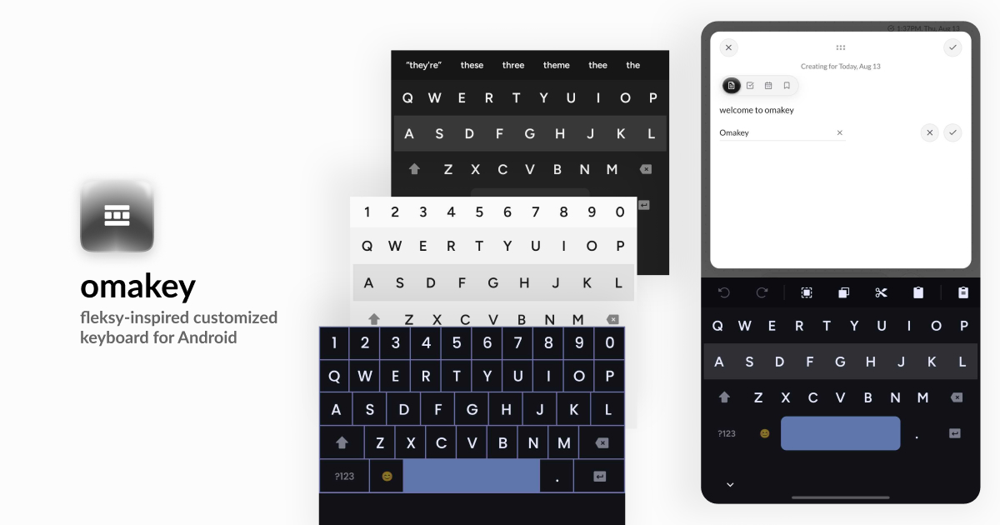

# omakey

**The keyboard for people who type like they mean it.**

Fast. Gesture-driven. Fully offline. Nothing you type ever leaves your phone.

---

## Why this exists

I used to love Fleksy. I still do — the gestures, the speed, the all-caps layout I've always
liked, the themes. It's unique and it's cool. I went keyboard-hunting for years before that, and
nothing else ever settled for me the way Fleksy did. I've been using it for more than a decade
now.

Recently I found out it's not on the Play Store anymore, so I went looking on Reddit for news or
alternatives. Found none. The keyboard I loved wasn't getting the updates I actually wanted —
latest emojis, image clipboard, things other keyboards already had.

So I built the keyboard I actually wanted to use.

omakey is the result of a habit around my own typing. Every feature in here exists because I
wanted it on my own phone — like undo/redo (I used to root my phone and install Xposed modules
just for this, back in the day). I use it as my daily driver, with a bunch of my Android friends
testing fast typing, autocorrect, and everything else. I'm improving it on a regular basis. Until
Google allows sideloading, this is probably where it stays — and maybe after that, I put it on
the Store.

It doesn't ask for internet access. The permission was never requested, so there's no way for
anything you type to leave your phone even by accident.

## What you won't find in most keyboards

- Inline calculator — type `12+7=` and `12+7=19` shows up in the suggestion strip, ready to tap.
- Undo/redo — two buttons that step back and forward through your last several typed or deleted
  words.
- Clipboard history — text and images, several at once, not just whatever you last copied.
- Grid layout mode — a bordered, edge-to-edge key style, separate from whichever color theme
  you're using.
- Gestures that do real work — swipe left deletes a whole word, swipe up saves it to your
  dictionary, drag the spacebar to move the cursor.
- An editable "Learned words" list — view, search, edit, or delete anything individually, not
  just wipe the whole dictionary.
- A theme editor with a live full-size preview and a proper HSV/hex color picker, aware of which
  layout (Normal or Grid) a theme was built for.

## Who this is for

- Anyone who used to love Fleksy.
- Anyone tired of a keyboard that corrects wrong and doesn't tell you why.
- Anyone who wants a keyboard that can't leak what they type, because it has no way to.
- One-handed and thumb typists who want the keyboard to work with them, not against them.

## What this isn't

- **Not a glide/swipe-to-type keyboard.** The gestures here are shortcuts for actions — delete a
  word, insert a space, cycle a suggestion — not tracing letters across the layout. You still tap
  out each word. Every gesture omakey has is documented below.
- **English (US QWERTY), for now.** No other languages or layouts yet.
- **Not on the Play Store yet.** Sideload it or build it from source — see [Getting
  started](#getting-started) below.
- **No cloud backup, no sync.** Your learned words, your clipboard, your settings stay on your
  phone. There's no server to sync any of it to.
- **No GIF search.** It'd need internet access, and I'm not asking for that permission just for
  GIFs.

## Everything it actually does

### Typing that keeps up with you

- Full QWERTY with shift, caps lock, two pages of symbols, and long-press accents (à, é, ñ, and
  more — hold a key like `e` or `a` to see its variants).
- The Enter key adapts to what you're typing into — "Go," "Search," "Send," "Next," "Done" —
  instead of always being a plain return key.
- A small preview bubble shows above your finger on every keypress, so you always know what
  landed. Turn it off in Settings if you'd rather not see it.
- Built to keep up with fast, sloppy typing — fingers overlapping mid-word won't throw it off.
- Optional double-tap (or double-swipe-right) space for a period, off by default. Same idea for a
  comma — swipe down right after a space instead, if you turn that on too.
- Keyboard height and position, adjustable in one screen: drag to resize, drag to lift it off the
  bottom edge for easier one-handed reach. Capped so it can never cover what you're typing into.

### Gestures — the whole point

This is the section to actually read. Every gesture works directly on the keyboard surface, no
menus involved:

| Gesture | What it does |
|---|---|
| **Swipe left** on any key | Deletes the entire last word, not just a character — its own "swoosh" sound and a shimmer across the home row so it's unmistakably not a normal tap. A trailing emoji or punctuation mark glued to a word with no space (`hahaha😂`) is its own swipe first — the emoji goes, then the word. |
| **Swipe right** on any key | Inserts a space (off by default, one tap to turn on). Swipe right twice quickly for a period instead, if "Double-tap space for period" is on. |
| **Swipe up** on the suggestion strip | Accepts the current suggestion — or, on a word you typed yourself, saves it to your personal dictionary so it's never flagged again. Swipe up a second time on an already-learned word to un-learn it. |
| **Swipe down** on the suggestion strip | Cycles backward through alternatives — the mirror of swipe up. Right after a space, with "Double space + swipe down for comma" on, it inserts a comma instead. |
| **Swipe up/down repeatedly** | Genuinely cycles through every alternative, as many times as you want, whether the word's still being typed or you've tapped back into something you wrote a minute ago. The one about to be typed stands out; the rest fade. |
| **Tap and hold Shift** | Locks in caps lock. A quick tap just capitalizes the next letter, then releases. |
| **Long-press and drag the spacebar** | Moves the cursor without needing to tap precisely inside your text — fixes a typo three words back without losing your place. |
| **Long-press a letter key** with accent variants | Fades into a full-width picker for that key's variants (à, á, â, ä...) — keep holding and drag to browse, lift to select. Drag further for a few extra everyday symbols. |
| **Swipe left/right in the emoji panel** | Slides between emoji categories. |
| Adjustable swipe sensitivity | A Settings slider tunes how far a swipe has to travel before it registers. |

### Suggestions and autocorrect

- Real autocorrect — typos get fixed the moment you finish the word, not just quietly offered for
  you to notice and tap. Got it wrong? One backspace undoes it, and it won't just re-correct back.
- Catches typos that need two fixes at once — a swapped letter pair *and* a wrong character — not
  just single-letter slips.
- Catches "real-word" mistakes too — "thus" when you meant "this" — based on the words around it,
  without ever auto-applying something that risky on its own.
- Offers alternatives even when what you typed is already a valid word, because only you know
  which one you actually meant.
- Shows you the fix *before* you finish typing — "corrcet" shows "correct" mid-word.
- Missing a space between two words ("thisis") gets split back apart automatically.
- Full contraction support (im → I'm, weve → we've, shoudve → should've) with fuzzy matching for
  typos of contractions too.
- Optional next-word prediction, off by default.
- Optional auto-capitalize, off by default.
- A "Learned words" screen — view, search, edit, or remove anything your typing has taught the
  keyboard, individually or all at once.
- The inline calculator mentioned above — `12+7=` shows `12+7=19` right in the strip, and tapping
  it fills in the missing `19`.
- A few matching emoji show up as extra chips next to word suggestions for words like "sad" or
  "happy" — tap one to insert it without touching the word itself.

### Undo, redo, and text tools — one tab away

Swipe to the Tools tab for:

- **Undo / Redo** for your last several typed or deleted words.
- **Select all / Copy / Cut / Paste**, without leaving the keyboard.
- **Clipboard history** — every recent copy, text and images, one tap away. Long-press to delete
  an item. Opening clipboard mode dims everything else so it's clearly its own space.

### A full, modern emoji picker

- A "Recent" category up front, so you're not hunting for the same one over and over.
- Thousands of emoji across every standard category.
- A dedicated kaomoji category — `(^_^)`, `ヽ(´▽\`)/`, sized properly instead of squeezed into the
  same grid as single-character emoji.
- A special-characters picker for °, ™, §, arrows, math symbols.
- Smooth directional slides switching categories or leaving the panel.

### Make it feel like yours

- Built-in themes — Light, Dark, Follow-system, Accent — with an option to pull the spacebar's
  color straight from your device's own wallpaper palette.
- **Grid layout mode**, independent of whichever color theme you're on — bordered, edge-to-edge
  cells with no gaps, a pressed key filling solid instead of just dimming. Border color and
  thickness (Small/Medium/Large) are both yours to set.
- A full custom theme builder — HSV picker, a hex field you can type into or copy from, and a
  live, full-size keyboard preview the whole time you're editing. Custom themes remember which
  layout they were built for, so you're only ever shown ones that actually fit.
- Adjustable key font.
- A home-row highlight, so you can find your place by feel without looking down.
- A consistent icon set for Shift, Backspace, and every Enter state.
- Capital letters always shown, or lowercase-until-Shift — your call.

### Feedback that feels right

- Adjustable haptic feedback with a strength slider.
- An optional keypress sound with a few click styles to preview and pick, plus its own volume.

### Accessible by default

- Automatic fallback for TalkBack users — screen-reader touch exploration switches omakey to
  standard tap-to-type so nothing gets in the way of accessibility tools.

## Privacy

omakey's manifest doesn't request the `INTERNET` permission. The app has no code path capable of
sending a network request. Nothing you type, copy, or teach it can leave your device. Your
dictionary, your clipboard, your settings all stay local.

## Status

omakey is on release 2.2.1. Typing, gestures, autocorrect, prediction, both layout styles, the
clipboard manager, and the emoji panel are all working today and getting updated regularly — see
[CHANGELOG.md](CHANGELOG.md) for the full history.

## Getting started

Not on the Play Store yet. In the meantime:

1. Grab the latest APK from the **[latest release](https://github.com/thehumanx/omakey/releases/latest)**
   (always points to the newest build), or build it yourself from source with Gradle.
2. Sideload it — you'll need to allow installs from whichever app you downloaded it with, the
   first time.
3. Open **Settings → System → Languages & input → On-screen keyboard**, and enable omakey.
4. Switch to it from the keyboard-switcher icon on your current keyboard, or that same Settings
   screen.

## License

[GPL-3.0](LICENSE). Fork it, modify it, ship your own version — just keep it open, the same way
this one is.

---

I built this because I missed typing fast.

