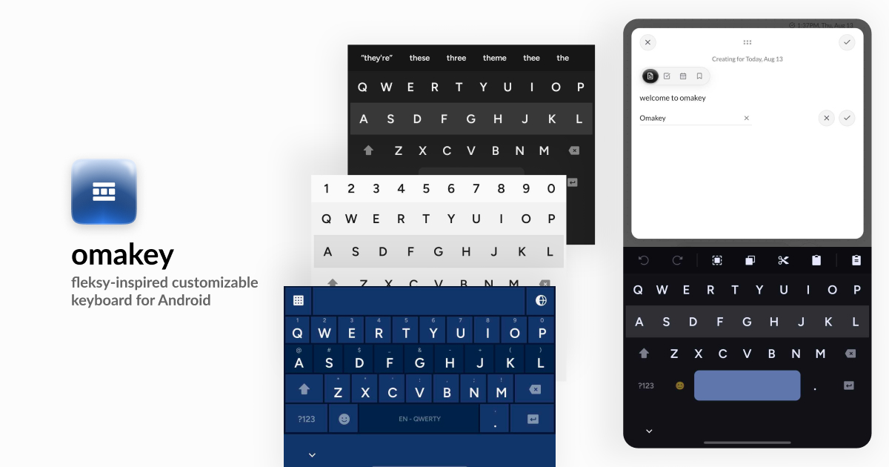

# omakey

**The keyboard for people who type like they mean it.**

Fast. Gesture-driven. Nothing you type ever leaves your phone.

---

## Why this exists

I used to love Fleksy. I still do — the gestures, the speed, the all-caps layout I've always
liked, the themes. It's unique and it's cool and it's fast. I went keyboard-hunting for years before that, and nothing else ever settled for me the way Fleksy did. I've been using it for more than a decade now.

Recently I found out it's not on the Play Store anymore, so I went looking on Reddit for news or
alternatives. Found none. The keyboard I loved wasn't getting the updates I actually wanted —
latest emojis, image clipboard, things other keyboards already had.

So I built the keyboard I actually wanted to use.

omakey is the result of a habit around my own typing. Every feature in here exists because I
wanted it on my own phone — like undo/redo (I used to root my phone and install Xposed modules
just for this, back in the day). I use it as my default keyboard, with a bunch of my Android friends
testing fast typing, autocorrect, and everything else. I'm improving it on a regular basis. Until
Google allows sideloading, this is probably where it stays — and maybe after that, I put it on
the Store.

It's offline by default. The only things that ever touch the network are checking for app updates
and downloading a language pack when you ask for one — nothing you type, copy, or type into any app
ever leaves your phone.

## App Updates / Plans and PSA
- I've publicly shared this keyboard only on Reddit threads (besides my website) and few kind volunteers have tried and provided feedback on fixes/improvements and features. 
- Languages beyond English arrived in 5.0.0: Spanish, French, Brazilian Portuguese and Nepali, each a small optional download. 5.1.0 adds Italian and Russian. More to come.
- I am prioritizing more on optimizing the UX and autocorrection/prediction engine as its being written from the scratch.
- The keyboard is optimized for battery usage as well. Fleksy used to take around 5-10%, while this takes just around 1%.
- Note: Not tested for old hardwares, if you do, please test and lmk feedback.
- send feedback or feature requests to omakey@iambishistha.com if you have any. thanks for trying.

---
- Upcoming: a second pass on the suggestion engine
- Planned features: more languages, voice input
- Not planned: glide-typing

## What omakey offers

- A floating keyboard you can put anywhere on screen.
- One-handed mode and drag-to-resize.
- Inline calculator — type `12+7=` and `12+7=19` shows up in the suggestion strip, ready to tap (took inspo from iOS keyboard).
- Undo/redo — two buttons that step back and forward through your last several typed or deleted
  words.
- Clipboard history — text and images.
- Grid layout mode — a bordered, edge-to-edge key style theme
- Gestures like on Fleksy — swipe left deletes a whole word (Swipe left and hold keeps deleting the words), swipe up saves it to your dictionary, swipe up/down to switch between the suggestions/corrections, hold and drag the spacebar to move the cursor, swipe right for space (off by default).
- An editable "Learned words" list — view, search, edit, or delete anything individually, not
  just wipe the whole dictionary (Note: the app is set to suggest your autolearned word after 3 enters).
- A theme editor that builds a whole matching, readable theme from one background colour, with a live, tappable preview and a proper HSV/hex color picker.
- Adjustable height and position for your keyboard (the position caps to center of the screen).

## Who this is for

- Anyone who used to love Fleksy (but the app has evolved a lot from there).
- Anyone who needs configurable and themable keyboard

## What this isn't

- **Not a glide/swipe-to-type keyboard.** The gestures here are shortcuts for actions — delete a
  word, insert a space, cycle a suggestion — not tracing letters across the layout. You still tap
  out each word. Every gesture omakey has is documented below.
- **Not every language.** English is built in; Spanish, French, Brazilian Portuguese, Italian, Russian and Nepali are optional downloads.
  More will follow, one at a time, each tested before it ships.
- **Not on the Play Store yet.** Sideload it or build it from source — see [Getting
  started](#getting-started) below.
- **No cloud backup, no sync.** Your learned words, your clipboard, your settings stay on your
  phone. There's no server to sync any of it to.
- **No GIF search.** It'd need real, ongoing network access (not the once-in-a-while manual update
  check), and that's a bigger privacy tradeoff than I want to make just for GIFs.

## Everything it actually does

### Typing that keeps up with you

- Full QWERTY with shift, caps lock, two pages of symbols, and long-press accents (à, é, ñ, and
  more — hold a key like `e` or `a` to see its variants).
- Type a symbol, then hit space — it drops you straight back into letters, no manual switch back
  needed.
- The Enter key adapts to what you're typing into — "Go," "Search," "Send," "Next," "Done" —
  instead of always being a plain return key.
- A small preview bubble shows above your finger on every keypress, so you always know what
  landed. Turn it off in Settings if you'd rather not see it.
- Built to keep up with fast, sloppy typing — fingers overlapping mid-word won't throw it off.
- Optional double-tap (or double-swipe-right) space for a period, off by default.
- Keyboard height and position, adjustable in one screen: drag to resize, drag to lift it off the
  bottom edge for easier one-handed reach. Capped so it can never cover what you're typing into.
- Optional padding down the left and right edges, so the outer keys aren't flush against a curved
  or bezel-less screen edge.

### Gestures — the whole point

This is the section to actually read. Every gesture works directly on the keyboard surface, no
menus involved:

| Gesture | What it does |
|---|---|
| **Swipe left** on any key | Deletes the entire last word, not just a character — its own "swoosh" sound and a shimmer across the home row so it's unmistakably not a normal tap. A trailing space is its own swipe first, then a trailing emoji or punctuation mark glued to a word with no space (`hahaha😂`), then the word itself — nothing bundles into the same swipe. |
| **Swipe right** on any key | Inserts a space (off by default, one tap to turn on). Swipe right twice quickly for a period instead, if "Double-tap space for period" is on. |
| **Swipe up** on the suggestion strip | Accepts the current suggestion — or, on a word you typed yourself, saves it to your personal dictionary so it's never flagged again. Swipe up a second time on an already-learned word to un-learn it. |
| **Swipe down** on the suggestion strip | Cycles backward through alternatives — the mirror of swipe up. |
| **Swipe up/down repeatedly** | Genuinely cycles through every alternative, as many times as you want, whether the word's still being typed or you've tapped back into something you wrote a minute ago. The one about to be typed stands out; the rest fade. |
| **Swipe up/down right after a `. , ! ? ; : ' "`** | Cycles through that whole set of punctuation instead of word suggestions — turn "." into "," into "!" and so on with repeated swipes, without retyping. Works whether the cursor sits right against the mark or one space past it, so it chains naturally off double-tap-space-for-period. |
| **Tap and hold Shift** | Locks in caps lock. A quick tap just capitalizes the next letter, then releases. |
| **Long-press and drag the spacebar** | Moves the cursor without needing to tap precisely inside your text — fixes a typo three words back without losing your place. |
| **Long-press a letter key** with accent variants | Fades into a full-width picker for that key's variants (à, á, â, ä...) — keep holding and drag to browse, lift to select. Drag further for a few extra everyday symbols. |
| **Swipe left/right in the emoji panel** | Slides between emoji categories. |
| Adjustable swipe sensitivity | A Settings slider tunes how far a swipe has to travel before it registers. |

### Put the keyboard where you want it

A button at the left of the suggestion bar opens Quick access — the things you decide in the
moment, while looking at whatever you're typing into:

- **Incognito** — stop the keyboard learning from what you type, for as long as it's on.

- **Floating** — detach the keyboard and drag it anywhere by the grab bar along its top. The app
  behind it stays visible *and* usable: tapping outside the keyboard reaches the app, and the app
  isn't shoved upward the way a docked keyboard shoves it.
- **One-handed** — shrink it to the left or right so your thumb reaches everything, with buttons
  alongside to switch sides, go back to full width, or resize.
- **Size & position** — drag the corners to resize, in whichever mode you're in, and drag the grip
  in the middle to raise a normal or one-handed keyboard off the bottom edge for easier thumb
  reach. Floating, one-handed and normal each remember their own size, so changing one doesn't
  disturb the others.
- **Grid layout** — flip between the normal and bordered-grid key styles.
- **Theme** — cycle Light, Dark, Follow-system and Accent without leaving the keyboard.
- **Language** — pick a language and, where it has more than one, its layout.
- **Settings** — one tap away.

### More than one language

English is built in. Other languages are separate downloads, so the keyboard stays small and you
only carry the ones you use. Settings → Languages → "Get more languages" lists what's available.

- **Spanish** — ñ on the keyboard, ¿ and ¡, and accents put back for you: type "cancion" and
  "canción" is what you get.
- **Portuguese (Brazil)** — ç on the keyboard next to L, and accents and tildes put back for you:
  "nao" becomes "não", "voce" becomes "você".
- **French** — AZERTY or QWERTY, your choice. Accents are restored the same way, and words like
  "l'homme" or "j'ai" are understood as two words, so the correction lands on the right one.
- **Nepali** — type it the way you'd text it, in English letters ("namaste", "mero"), and the
  Devanagari appears as you go; tap a different choice in the strip if the first isn't right, or
  keep the English spelling for English words. There's also a proper Devanagari keyboard if you'd
  rather type the script directly.
- **Italian** — accents put back for you ("perche" becomes "perché", and the wrong-way "perchè"
  too), with an apostrophe key for "l'", "c'è" and "un'altra", which are understood as two words.
- **Russian** — three keyboards: the standard ЙЦУКЕН, a phonetic one with each letter where the
  English letter that sounds like it sits (я on Q, в on W), and a translit one: type "privet" in
  English letters and get "привет", whichever way you spell it ("horosho" or "khorosho").

With more than one language turned on, a globe button appears at the right of the suggestion bar:
tap it to step through every language and layout, hold it to pick one. The spacebar quietly shows
where you are ("PT BR - QWERTY"). Prefer the globe down by the spacebar? Settings → Keyboard swaps
it with the emoji button. Each language learns its own words, so switching never mixes one
language's vocabulary into another. Removing a language keeps what it
learned, in case you add it back.

### Suggestions and autocorrect

- Real autocorrect — typos get fixed the moment you finish the word, not just quietly offered for
  you to notice and tap. Got it wrong? One backspace undoes it, and it won't just re-correct back.
- Catches typos that need two fixes at once — a swapped letter pair *and* a wrong character — not
  just single-letter slips.
- Fixes the *first* letter too — "qccount" becomes "account", "hte" becomes "the" — as long as the
  slip is a plausible one: a neighbouring key, a stray leading character, two letters swapped, or a
  first letter missed entirely.
- Catches "real-word" mistakes too — "thus" when you meant "this" — based on the words around it,
  without ever auto-applying something that risky on its own.
- Offers alternatives even when what you typed is already a valid word, because only you know
  which one you actually meant.
- Shows you the fix *before* you finish typing — "corrcet" shows "correct" mid-word.
- Missing a space between two words ("thisis") gets split back apart automatically.
- Full contraction support (im → I'm, weve → we've, shoudve → should've) with fuzzy matching for
  typos of contractions too.
- Knows what usually comes next — suggestions are ranked by the words on either side, not just by
  which word is commonest overall.
- Learns the words *you* use. Names, slang, jargon, project names: type one three times and it
  stops being flagged as a typo and starts turning up as a suggestion. Nothing counts as learned
  before that, so an occasional slip doesn't stick — and a word you delete or correct straight
  after typing is never learned at all. Words you stop using fade out on their own.
- **Incognito** — an eye button in the tools row pauses learning whenever you want it, and password
  fields are never learned from at all, automatically. None of it ever leaves your phone.
- Optional next-word prediction, off by default.
- Optional auto-capitalize, off by default.
- A "Learned words" screen — view, search, edit, or remove anything your typing has taught the
  keyboard, individually or all at once. And a Settings switch to turn learning off entirely.
- The inline calculator mentioned above — `12+7=` shows `12+7=19` right in the strip, and tapping
  it fills in the missing `19`.
- A few matching emoji show up as extra chips next to word suggestions for words like "sad" or
  "happy" — tap one to insert it without touching the word itself.

### Undo, redo, and text tools — one tab away

Swipe to the Tools tab for:

- **Undo / Redo** for your last several typed or deleted words. A paste, a cut or a deleted
  selection counts as one step, however much text it moved.
- **Select all / Copy / Cut / Paste**, without leaving the keyboard.
- **Clipboard history** — every recent copy, text and images, one tap away. Long-press an entry to
  pin or remove it; pinned entries stay at the top and are never cleared out to make room for newer
  ones. Opening clipboard mode dims everything else so it's clearly its own space.
- Settings → Privacy & data has the full list: see everything that's saved, unpin or remove single
  entries, clear all of it, or turn clipboard history off entirely. Turning it off stops new
  entries without deleting what's already there.
- Passwords are never saved. Clips an app marks as sensitive are skipped, and nothing is recorded
  while incognito is on or a password field is focused.

### A full, modern emoji picker

- A "Recent" category up front, so you're not hunting for the same one over and over.
- Thousands of emoji across every standard category.
- A dedicated kaomoji category — `(^_^)`, `ヽ(´▽\`)/`, sized properly instead of squeezed into the
  same grid as single-character emoji.
- A special-characters picker for °, ™, §, arrows, math symbols.
- Six skin tones, set once in Settings and applied to hands, faces and people everywhere emoji
  turn up — including the suggestion chips.
- Smooth directional slides switching categories or leaving the panel.

### Make it feel like yours

- Built-in themes — Light, Dark, Follow-system, and Accent, which builds the whole keyboard from
  your device's own Material You palette and follows your system light/dark setting. Plus an
  option to pull just the accent from that palette on any theme.
- One colour rule everywhere: whatever you're pressing fills with the theme's tap colour, and
  whatever is switched on — caps lock, Shift, an open panel, the selected tile — takes its accent.
- A live keyboard preview in Settings that reflects your theme, layout style, font, key
  backgrounds, home-row highlight and capitalization as you change them — and responds to touch,
  so you can see the tap colour, and the accent on Shift and caps lock.
- **Grid layout mode**, independent of whichever color theme you're on — bordered, edge-to-edge
  cells with no gaps, a pressed key filling solid instead of just dimming. Border color and
  thickness (Small/Medium/Large) are both yours to set.
- A full custom theme builder. Pick a background and the rest — keys, tap, accent, spacebar,
  home-row and grid border — is chosen to match it, light or dark, and kept readable. Change any of
  them on top, or reset one back to automatic. An HSV picker, a hex field you can type into or copy
  from, and a live, full-size keyboard preview the whole time you're editing; leaving with unsaved
  changes asks first. Custom themes remember which layout they were built for, so you're only ever
  shown ones that actually fit.
- Adjustable key font — System, Poppins, Figtree, Solway or Aleo.
- A home-row highlight, so you can find your place by feel without looking down.
- A consistent icon set for Shift, Backspace, and every Enter state.
- Capital letters always shown, or lowercase-until-Shift — your call.

### Feedback that feels right

- Adjustable haptic feedback with a strength slider.
- An optional keypress sound with a few click styles to preview and pick, plus its own volume.

### Accessible by default

- Automatic fallback for TalkBack users — screen-reader touch exploration switches omakey to
  standard tap-to-type so nothing gets in the way of accessibility tools.

### Staying up to date

- Since omakey isn't on the Play Store (yet), Settings' About section checks GitHub for the
  latest release instead — a manual "Check for updates" button, plus an "Automatic update checks"
  toggle (on by default) that quietly checks every 12 hours and sends a notification if there's a
  newer version, without ever downloading or installing anything itself.

## Privacy

omakey is offline by default. Nothing you type, copy, or teach it can leave your device, and
there's no analytics or ad SDK anywhere in the app. Your dictionary, your clipboard, your settings
all stay local.

Clipboard history is the one thing omakey stores that you didn't type at it, so it gets explicit
limits: clips an app marks as sensitive (passwords, mostly) are never saved, nothing is saved while
incognito is on or a password field is focused, and Settings → Privacy & data lets you review it,
clear it, or switch it off entirely.

Two things use the network, and nothing else does:

- **Update checks.** Settings' About section has a manual "Check for updates" button, and (on by
  default, toggleable off) a periodic check every 12 hours that notifies you if a newer version is
  out. It's a lookup against GitHub's public Releases API — never an auto-download or auto-install.
- **Language packs.** Languages other than English are separate downloads. Nothing is fetched until
  you tap "Get more languages" in Settings → Languages and pick one. Packs contain only data
  (a keyboard layout, word lists, a language model) — never code — and are checked against a
  signed list before they're installed.

Neither sends anything you type, or any other data about you.

## Status

omakey is on release 5.1.0, which adds Italian and Russian (with ЙЦУКЕН, phonetic and translit
keyboards) and a theme builder that works out a whole matching theme from one background colour.
5.0.0 before it was the languages release: Spanish, French, Brazilian Portuguese and Nepali as
optional downloads, with a globe button to switch between them and their layouts, a reorganised
strip above the keys, Settings split into pages, and a floating keyboard that follows your finger.

Typing, gestures, autocorrect, prediction, both layout styles, the clipboard manager, and the emoji
panel are all working today and getting updated regularly — see [CHANGELOG.md](CHANGELOG.md) for the
full history.

## Getting started

Not on the Play Store yet. In the meantime:

1. Grab the latest APK from the **[latest release](https://github.com/thehumanx/omakey/releases/latest)**
   (always points to the newest build), or build it yourself from source with Gradle.
2. Sideload it — you'll need to allow installs from whichever app you downloaded it with, the
   first time.
3. Open **Settings → System → Languages & input → On-screen keyboard**, and enable omakey.
4. Switch to it from the keyboard-switcher icon on your current keyboard, or that same Settings
   screen.

## License

[GPL-3.0](LICENSE). Fork it, modify it, ship your own version — just keep it open, the same way
this one is.

